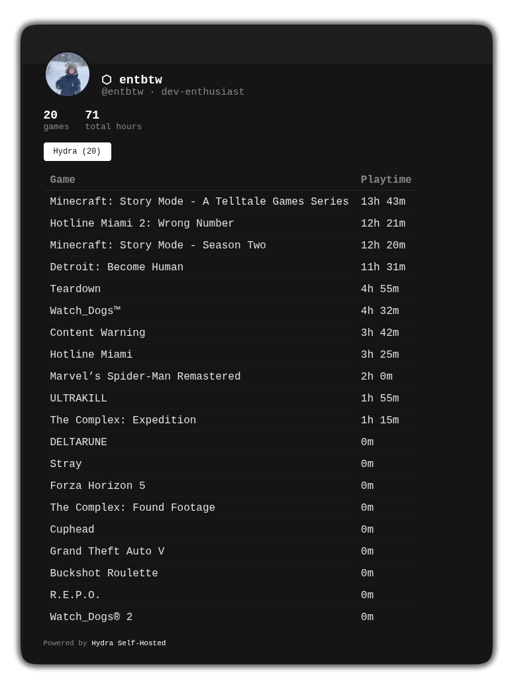

# hydra-selfhosted

Self-hosted backend for the [entitybtw/hydra](https://github.com/entitybtw/hydra) fork of Hydra Launcher.

Run your own server for cloud saves, accounts, and profiles — no Hydra Cloud subscription needed.



## What you get

- **Cloud saves** — game save backups stored on your own server
- **Accounts** — register and log in with a username and password
- **Public profile** — shareable page at `/u/username` with playtime and game library
- **Web dashboard** — edit your profile, customize accent color and CSS
- **Steam hours on profile** — connect your Steam account in the dashboard to show Steam playtime on your public profile
- **No subscription** — works without Hydra Cloud, unlimited cloud save slots

## Requirements

- Docker + Docker Compose

## Setup

```bash
git clone https://github.com/entitybtw/hydra-selfhosted.git
cd hydra-selfhosted
cp .env.example .env
# edit .env — set API_TOKEN to a random secret string
docker compose up -d --build
```

The server runs on port 3000 by default.

## .env options

```env
API_TOKEN=your-random-secret        # required
PORT=3000
SESSION_TTL_DAYS=30                 # launcher session duration (default 30)
PUBLIC_URL=http://your-server:3000  # shown in the web dashboard
```

## Connecting to Hydra Launcher

1. Open the [entitybtw/hydra](https://github.com/entitybtw/hydra) fork
2. **Settings → Self-Hosted API**
3. Enter your server URL and `API_TOKEN`
4. Click **Save** — a login window opens
5. Register or log in — the launcher connects automatically

## Web dashboard

Go to `http://your-server:3000`, enter your `API_TOKEN`, then log in.

From the dashboard you can edit your profile, set up Steam integration, browse your library, change your password, and view your public profile.

## Data

Everything is stored in `./data/` — back this folder up to preserve all user data.

## Updating

```bash
git fetch origin && git checkout origin/main -- api/ docker-compose.yml && docker compose up --build -d
```

Your `.env` and `data/` are never modified by updates.
